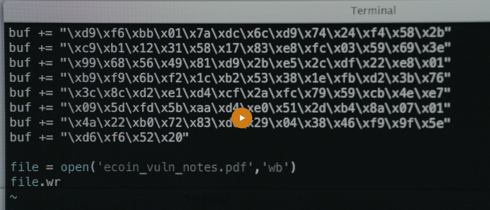
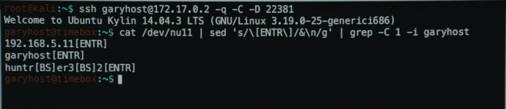

# Real World Hacking in the TV Show [Mr. Robot](https://www.imdb.com/title/tt4158110/?ref_=nv_sr_1?ref_=nv_sr_1)

## Reconnaissance

In this screenshot from **Mr. Robot**, Elliot runs [`volatility`](https://www.volatilityfoundation.org/) (a forensics tool used to dump and analyze a system's memory). Based on the command's output, it seems he's trying to find the address in memory of a `dynamically linked library` (a library that a program will ask the system to find when it loads, instead of one that is bundled with a program to use directly) used to detect hardware (e.g. disks, keyboard, mouse, network and graphics cards, etc.). In this case, the _`dll`_ seems to be `libhd.so`. I assume this is so he can control data coming or going from system devices (such as the keyboard or mouse). For example, this may be for a `keylogger` to spy on anything the user types on their keyboard.

## Weaponization

In this screenshot from **Mr. Robot**, Elliot is injecting [**`shellcode`**](https://en.m.wikipedia.org/wiki/Shellcode) ([`hexadecimal`](https://en.m.wikipedia.org/wiki/Hexadecimal) - a base16 numbering system - encoded computer instructions) that will be used to **exploit a PDF vulnerability.** The PDF will be sent to a victim who will be compromised after they open the file.

## Exfiltration

In this screenshot from **Mr. Robot**, Elliot is reading the **keylogger** data he has stored on the victim's machine in a file called _`/dev/nu11`_. This is pretty clever - in Linux, [**`/dev/null`**](https://en.m.wikipedia.org/wiki/Null_device) is a **"blackhole"** - data that should be ignored is redirected here so to avoid printing it to the screen or storing it in a file. The most common use case for writing to **`/dev/null`** is the data output from a command, script, or application that isn't needed. Elliot is trying to evade notice by writing to _`/dev/nu11`_ because someone looking for a malicious process may mistakenly believe the process is writing to **`/dev/null`** and not attempt to look because they think no data can be read from there.
